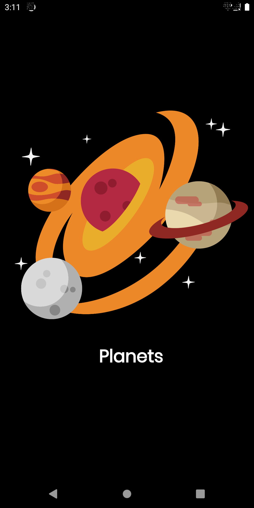
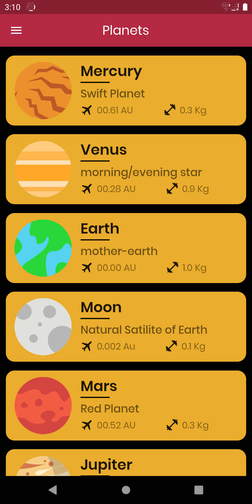
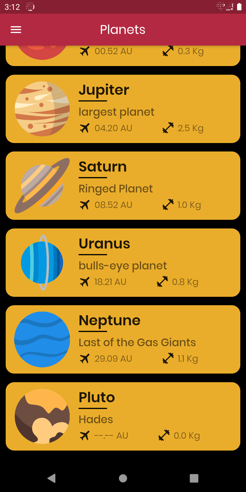
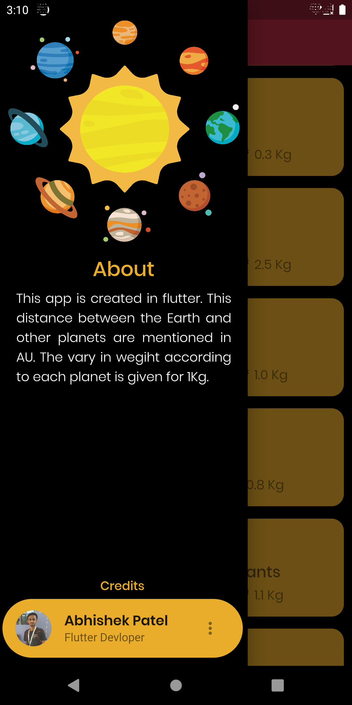

# Planets App

Planets App is built using FLutter.
This is a basic app which has planets and its name.
it also contains the distance between the earth and other planets, the wegiht of a a person on diffrent planets can be checked ,here its only given for 1Kg.

APk for this is available in the APK directory..

                            

This is a simple one screen app with a drawer included. This is a simple app which has a simple user interface. it has the name and image of planets with a little information about the planet,like the distance between earth and other planets, the weight of you if you were on other planet ,here i since its a static app i have put the weight for 1 Kg. Since it was Single screen app i concentrated more on the user interface of the App. i have maintained a Black theme app.   

## Getting Started

This project is a starting point for a Flutter application.

A few resources to get you started if this is your first Flutter project:

- [Lab: Write your first Flutter app](https://flutter.dev/docs/get-started/codelab)
- [Cookbook: Useful Flutter samples](https://flutter.dev/docs/cookbook)

For help getting started with Flutter, view our
[online documentation](https://flutter.dev/docs), which offers tutorials,
samples, guidance on mobile development, and a full API reference.

